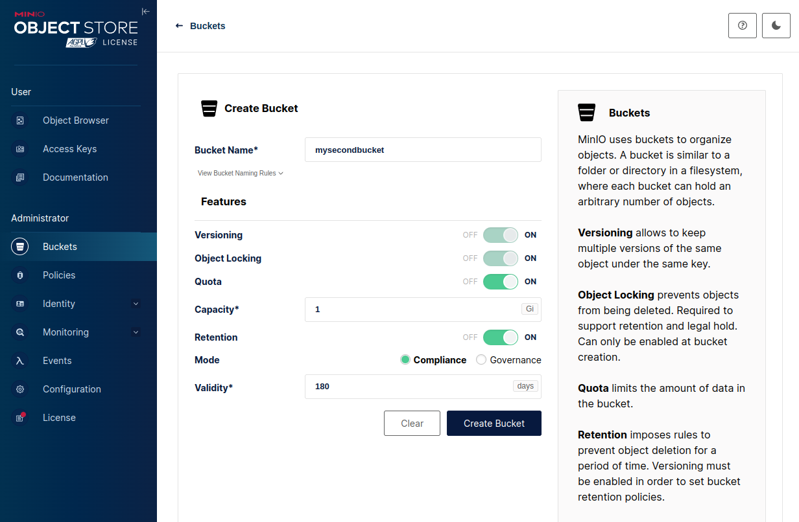
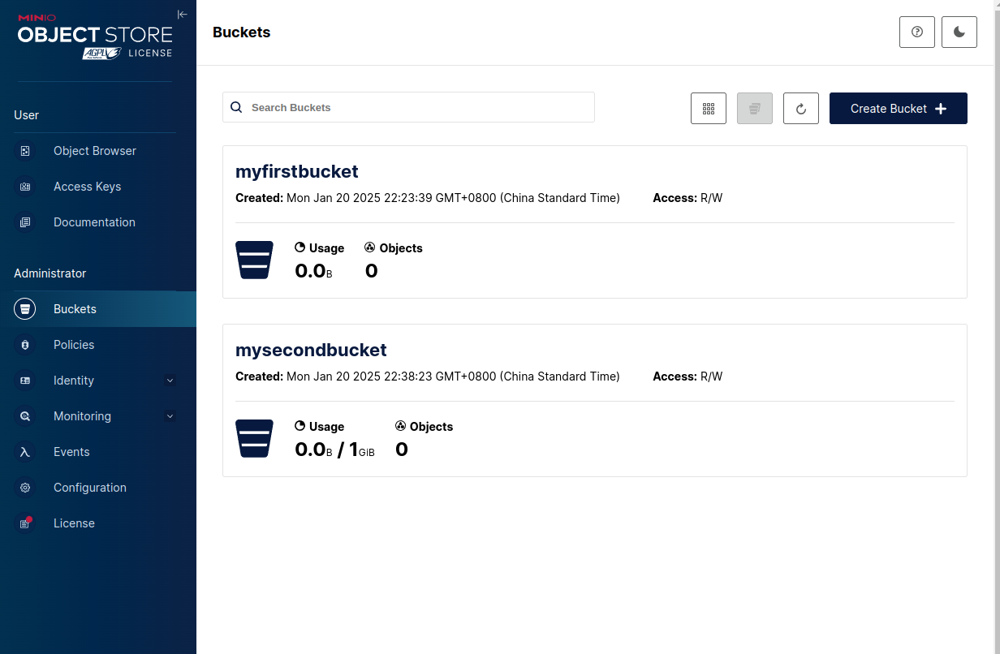

# 第二章 Minio的启动

## 2.2 一切的开端
我们可以通过如下命令启动Minio服务。`minio`是可执行程序，可由Go源码编译生成。
```
$ tree -Rhp /miniodata/data/
[drwxrwxr-x 4.0K]  /miniodata/data/

0 directories, 0 files
$ ./minio server /miniodata/data
INFO: Formatting 1st pool, 1 set(s), 1 drives per set.
INFO: WARNING: Host local has more than 0 drives of set. A host failure will result in data becoming unavailable.
MinIO Object Storage Server
Copyright: 2015-2025 MinIO, Inc.
License: GNU AGPLv3 - https://www.gnu.org/licenses/agpl-3.0.html
Version: DEVELOPMENT.2025-01-19T23-13-17Z (go1.23.4 linux/amd64)

API: http://192.168.1.3:9000  http://127.0.0.1:9000 
   RootUser: minioadmin 
   RootPass: minioadmin 

WebUI: http://192.168.1.3:35389 http://127.0.0.1:35389     
   RootUser: minioadmin 
   RootPass: minioadmin 

CLI: https://min.io/docs/minio/linux/reference/minio-mc.html#quickstart
   $ mc alias set 'myminio' 'http://192.168.1.3:9000' 'minioadmin' 'minioadmin'

Docs: https://docs.min.io
WARN: Detected default credentials 'minioadmin:minioadmin', we recommend that you change these values with 'MINIO_ROOT_USER' and 'MINIO_ROOT_PASSWORD' environment variables

```
服务自动创建的文件目录结构:
```
$ tree -aRph /miniodata/data/
[drwxrwxr-x 4.0K]  /miniodata/data/
└── [drwxrwxr-x 4.0K]  .minio.sys
    ├── [drwxrwxr-x 4.0K]  buckets
    │   ├── [drwxrwxr-x 4.0K]  .bloomcycle.bin
    │   │   └── [-rw-rw-r--  507]  xl.meta
    │   └── [drwxrwxr-x 4.0K]  .usage.json
    │       └── [-rw-rw-r--  634]  xl.meta
    ├── [drwxrwxr-x 4.0K]  config
    │   ├── [drwxrwxr-x 4.0K]  config.json
    │   │   └── [-rw-rw-r-- 9.5K]  xl.meta
    │   └── [drwxrwxr-x 4.0K]  iam
    │       └── [drwxrwxr-x 4.0K]  format.json
    │           └── [-rw-rw-r--  434]  xl.meta
    ├── [-rw-rw-r--  232]  format.json
    ├── [drwxrwxr-x 4.0K]  multipart
    ├── [drwxrwxr-x 4.0K]  pool.bin
    │   └── [-rw-rw-r--  489]  xl.meta
    └── [drwxrwxr-x 4.0K]  tmp
        ├── [-rw-rw-r-- 2.0K]  8f098028-159a-41a2-8e64-d5053595a3ab
        └── [drwxrwxr-x 4.0K]  .trash

13 directories, 7 files
```
通过Web GUI创建一个名为`myfirstbucket`的对象桶后:
```
$ tree -aRph /miniodata/data/
[drwxrwxr-x 4.0K]  /miniodata/data/
├── [drwxrwxr-x 4.0K]  .minio.sys
│   ├── [drwxrwxr-x 4.0K]  buckets
│   │   ├── [drwxrwxr-x 4.0K]  .bloomcycle.bin
│   │   │   └── [-rw-rw-r--  618]  xl.meta
│   │   ├── [drwxrwxr-x 4.0K]  myfirstbucket
│   │   │   ├── [drwxrwxr-x 4.0K]  .metadata.bin
│   │   │   │   └── [-rw-rw-r-- 1.2K]  xl.meta
│   │   │   ├── [drwxrwxr-x 4.0K]  .usage-cache.bin
│   │   │   │   └── [-rw-rw-r--  580]  xl.meta
│   │   │   └── [drwxrwxr-x 4.0K]  .usage-cache.bin.bkp
│   │   │       └── [-rw-rw-r--  580]  xl.meta
│   │   ├── [drwxrwxr-x 4.0K]  .usage-cache.bin
│   │   │   └── [-rw-rw-r--  595]  xl.meta
│   │   ├── [drwxrwxr-x 4.0K]  .usage-cache.bin.bkp
│   │   │   └── [-rw-rw-r--  595]  xl.meta
│   │   └── [drwxrwxr-x 4.0K]  .usage.json
│   │       └── [-rw-rw-r-- 1.5K]  xl.meta
│   ├── [drwxrwxr-x 4.0K]  config
│   │   ├── [drwxrwxr-x 4.0K]  config.json
│   │   │   └── [-rw-rw-r-- 9.5K]  xl.meta
│   │   └── [drwxrwxr-x 4.0K]  iam
│   │       ├── [drwxrwxr-x 4.0K]  format.json
│   │       │   └── [-rw-rw-r--  434]  xl.meta
│   │       └── [drwxrwxr-x 4.0K]  sts
│   │           └── [drwxrwxr-x 4.0K]  47AFN829ISGLL4SRCZKS
│   │               └── [drwxrwxr-x 4.0K]  identity.json
│   │                   └── [-rw-rw-r--  910]  xl.meta
│   ├── [-rw-rw-r--  232]  format.json
│   ├── [drwxrwxr-x 4.0K]  multipart
│   ├── [drwxrwxr-x 4.0K]  pool.bin
│   │   └── [-rw-rw-r--  489]  xl.meta
│   └── [drwxrwxr-x 4.0K]  tmp
│       ├── [-rw-rw-r-- 2.0K]  8f098028-159a-41a2-8e64-d5053595a3ab
│       └── [drwxrwxr-x 4.0K]  .trash
│           ├── [drwxrwxr-x 4.0K]  03a2796b-40fd-4194-9c87-8cecd47fa66b
│           │   └── [-rw-rw-r--  603]  xl.meta.bkp
│           ├── [drwxrwxr-x 4.0K]  71c675d2-ea80-48e5-8612-ad69aaa1f0dd
│           │   └── [-rw-rw-r--  634]  xl.meta.bkp
│           ├── [drwxrwxr-x 4.0K]  829b7ee1-082c-44f9-87f8-d3e362fdd5da
│           │   └── [-rw-rw-r--  634]  xl.meta.bkp
│           ├── [drwxrwxr-x 4.0K]  8e29c0b6-5c49-403d-b8be-d36f098a9ba9
│           │   └── [-rw-rw-r--  588]  xl.meta.bkp
│           ├── [drwxrwxr-x 4.0K]  97c5ab87-b1ff-4d26-95c5-21591d79b0c8
│           │   └── [-rw-rw-r--  573]  xl.meta.bkp
│           ├── [drwxrwxr-x 4.0K]  bfb2e472-2f1c-49dc-8452-c5d1a45b76f9
│           │   └── [-rw-rw-r--  634]  xl.meta.bkp
│           ├── [drwxrwxr-x 4.0K]  e5150ba6-735b-46b2-8647-0c17edeaf5fe
│           │   └── [-rw-rw-r--  634]  xl.meta.bkp
│           └── [drwxrwxr-x 4.0K]  f3c18535-a021-401f-9ff6-3011e3121556
│               └── [-rw-rw-r--  552]  xl.meta.bkp
└── [drwxrwxr-x 4.0K]  myfirstbucket

31 directories, 21 files
```
通过Web GUI创建一个名为`mysecondbucket`的对象桶, 注意我们启用很多高级功能.

创建成功后，文件目录结构如下:
```
$ tree -aRph /miniodata/data/
[drwxrwxr-x 4.0K]  /miniodata/data/
├── [drwxrwxr-x 4.0K]  .minio.sys
│   ├── [drwxrwxr-x 4.0K]  buckets
│   │   ├── [drwxrwxr-x 4.0K]  .bloomcycle.bin
│   │   │   └── [-rw-rw-r--  741]  xl.meta
│   │   ├── [drwxrwxr-x 4.0K]  myfirstbucket
│   │   │   ├── [drwxrwxr-x 4.0K]  .metadata.bin
│   │   │   │   └── [-rw-rw-r-- 1.2K]  xl.meta
│   │   │   ├── [drwxrwxr-x 4.0K]  .usage-cache.bin
│   │   │   │   └── [-rw-rw-r--  580]  xl.meta
│   │   │   └── [drwxrwxr-x 4.0K]  .usage-cache.bin.bkp
│   │   │       └── [-rw-rw-r--  580]  xl.meta
│   │   ├── [drwxrwxr-x 4.0K]  mysecondbucket
│   │   │   └── [drwxrwxr-x 4.0K]  .metadata.bin
│   │   │       └── [-rw-rw-r-- 1.5K]  xl.meta
│   │   ├── [drwxrwxr-x 4.0K]  .usage-cache.bin
│   │   │   └── [-rw-rw-r--  595]  xl.meta
│   │   ├── [drwxrwxr-x 4.0K]  .usage-cache.bin.bkp
│   │   │   └── [-rw-rw-r--  595]  xl.meta
│   │   └── [drwxrwxr-x 4.0K]  .usage.json
│   │       └── [-rw-rw-r-- 1.5K]  xl.meta
│   ├── [drwxrwxr-x 4.0K]  config
│   │   ├── [drwxrwxr-x 4.0K]  config.json
│   │   │   └── [-rw-rw-r-- 9.5K]  xl.meta
│   │   └── [drwxrwxr-x 4.0K]  iam
│   │       ├── [drwxrwxr-x 4.0K]  format.json
│   │       │   └── [-rw-rw-r--  434]  xl.meta
│   │       └── [drwxrwxr-x 4.0K]  sts
│   │           └── [drwxrwxr-x 4.0K]  47AFN829ISGLL4SRCZKS
│   │               └── [drwxrwxr-x 4.0K]  identity.json
│   │                   └── [-rw-rw-r--  910]  xl.meta
│   ├── [-rw-rw-r--  232]  format.json
│   ├── [drwxrwxr-x 4.0K]  multipart
│   ├── [drwxrwxr-x 4.0K]  pool.bin
│   │   └── [-rw-rw-r--  489]  xl.meta
│   └── [drwxrwxr-x 4.0K]  tmp
│       ├── [-rw-rw-r-- 2.0K]  8f098028-159a-41a2-8e64-d5053595a3ab
│       └── [drwxrwxr-x 4.0K]  .trash
│           ├── [drwxrwxr-x 4.0K]  129dd092-52ca-4c70-bde7-e1efb6caef6e
│           │   └── [-rw-rw-r-- 1.4K]  xl.meta.bkp
│           ├── [drwxrwxr-x 4.0K]  2010810f-880f-48ed-b0a4-0c8e74129374
│           │   └── [-rw-rw-r--  741]  xl.meta.bkp
│           ├── [drwxrwxr-x 4.0K]  36a82aa4-f1da-4bf2-97ee-c01f38e5e68f
│           │   └── [-rw-rw-r--  580]  xl.meta.bkp
│           ├── [drwxrwxr-x 4.0K]  3c40a5d3-1c3b-4241-8d73-b0d95b1803b3
│           │   └── [-rw-rw-r--  741]  xl.meta.bkp
│           ├── [drwxrwxr-x 4.0K]  40738195-bd27-4921-b731-82b6b77953b0
│           │   └── [-rw-rw-r--  604]  xl.meta.bkp
│           ├── [drwxrwxr-x 4.0K]  427342a6-1b75-4a4c-8dd4-0cc78c63ecca
│           │   └── [-rw-rw-r--  580]  xl.meta.bkp
│           ├── [drwxrwxr-x 4.0K]  57ae0a3e-2568-4710-b70e-51150a9fc685
│           │   └── [-rw-rw-r-- 1.4K]  xl.meta.bkp
│           ├── [drwxrwxr-x 4.0K]  585ff150-81d2-4d09-afd1-d9a5d1ec1cf5
│           │   └── [-rw-rw-r--  580]  xl.meta.bkp
│           ├── [drwxrwxr-x 4.0K]  6704f49c-6490-4e1b-bc52-7e25a5a96042
│           │   └── [-rw-rw-r--  580]  xl.meta.bkp
│           ├── [drwxrwxr-x 4.0K]  7960e036-beba-4e8c-9a95-66af55415de4
│           │   └── [-rw-rw-r--  604]  xl.meta.bkp
│           ├── [drwxrwxr-x 4.0K]  7d8a5a81-277d-47f9-9f79-f2bb08c5ed48
│           │   └── [-rw-rw-r--  595]  xl.meta.bkp
│           ├── [drwxrwxr-x 4.0K]  7daf7ffb-b6bc-40c9-8156-e3f0797f2ece
│           │   └── [-rw-rw-r-- 1.5K]  xl.meta.bkp
│           ├── [drwxrwxr-x 4.0K]  7eda0e86-0b98-4b48-85cf-506cd4280f51
│           │   └── [-rw-rw-r--  595]  xl.meta.bkp
│           ├── [drwxrwxr-x 4.0K]  9147277d-7e48-445c-b136-2ced4ded5b13
│           │   └── [-rw-rw-r--  580]  xl.meta.bkp
│           ├── [drwxrwxr-x 4.0K]  a3b8d680-1b42-4799-8103-3bfd16a46506
│           │   └── [-rw-rw-r-- 1.5K]  xl.meta.bkp
│           ├── [drwxrwxr-x 4.0K]  abf3071f-6815-48dd-8a46-d9cabfcdda98
│           │   └── [-rw-rw-r--  580]  xl.meta.bkp
│           ├── [drwxrwxr-x 4.0K]  ad00e7f8-3852-46f5-8917-b321d37b2bce
│           │   └── [-rw-rw-r--  595]  xl.meta.bkp
│           ├── [drwxrwxr-x 4.0K]  c9d4f0cb-e4b4-4026-bb5b-f4efd7e201df
│           │   └── [-rw-rw-r-- 1.5K]  xl.meta.bkp
│           ├── [drwxrwxr-x 4.0K]  d62a99e9-ac78-4753-a285-e87e8a5738d7
│           │   └── [-rw-rw-r--  595]  xl.meta.bkp
│           ├── [drwxrwxr-x 4.0K]  e9e5ec25-9aa8-4fe3-b1e9-69fdf9b6765a
│           │   └── [-rw-rw-r-- 1.5K]  xl.meta.bkp
│           └── [drwxrwxr-x 4.0K]  f3deb22d-41aa-4c94-ac64-60e8504fee3f
│               └── [-rw-rw-r--  741]  xl.meta.bkp
├── [drwxrwxr-x 4.0K]  myfirstbucket
└── [drwxrwxr-x 4.0K]  mysecondbucket

47 directories, 35 files    
```


### 2.2.1 代码的起点
Go执行程序的开端是`main`包的`main`函数。Minio文件`minio/main.go`中响应的`main`函数源码如下：
```
// Copyright (c) 2015-2021 MinIO, Inc.
//
// This file is part of MinIO Object Storage stack
//
// This program is free software: you can redistribute it and/or modify
// it under the terms of the GNU Affero General Public License as published by
// the Free Software Foundation, either version 3 of the License, or
// (at your option) any later version.
//
// This program is distributed in the hope that it will be useful
// but WITHOUT ANY WARRANTY; without even the implied warranty of
// MERCHANTABILITY or FITNESS FOR A PARTICULAR PURPOSE.  See the
// GNU Affero General Public License for more details.
//
// You should have received a copy of the GNU Affero General Public License
// along with this program.  If not, see <http://www.gnu.org/licenses/>.

package main // import "github.com/minio/minio"

import (
	"os"

	// MUST be first import.
	_ "github.com/minio/minio/internal/init"

	minio "github.com/minio/minio/cmd"
)

func main() {
	minio.Main(os.Args)
}
```
其主要有3步：
1. 引入了`github.com/minio/minio/internal/init`包，这个包的作用是初始化一些全局变量，比如日志系统，配置系统等。
2. 以别名`minio`引入了`github.com/minio/minio/cmd`包，这个包是真正的命令行处理包，它包含了所有的命令行处理函数。
3. 调用了`minio.Main`函数，这个函数是真正的入口函数，它接受一个参数，是命令行参数。

### 2.2.2 Internal包的初始化
`minio/internal/init`包中有2个文件: `init_darwin_adm64.go`, `init.go`。主要是时间的配置。
- `init.go`文件中定义了`init`函数: 配置使用UTC时间。
```
package init

import "os"

func init() {
	// All MinIO operations must be under UTC.
	os.Setenv("TZ", "UTC")
}
```
- `init_darwin_adm64.go`文件中定义了`init`函数: 配置使用UTC时间, 零实行的Bug修复(https://github.com/golang/go/issues/49233)。

### 2.2.3 `minio.Main`函数
`minio/cmd/main.go`文件中定义了`Main`函数，它是真正的入口函数，它接受一个参数，是命令行参数。首先，它获取了命令行参数的第一个参数，作为app的名字。然后，调用了`newApp`函数，创建了一个app对象。最后，调用了app对象的`Run`方法，传入了命令行参数。如果`Run`方法返回了错误，那么就退出程序。
```
// Main main for minio server.
func Main(args []string) {
	// Set the minio app name.
	appName := filepath.Base(args[0])
...
	// Run the app - exit on error.
	if err := newApp(appName).Run(args); err != nil {
		os.Exit(1) //nolint:gocritic
	}
}
```

### 2.2.4 `newApp`函数与命令集
`newApp`函数创建了一个app对象，这个对象包含了所有的命令集。
```
func newApp(name string) *cli.App {
	// Collection of minio commands currently supported are.
	commands := []cli.Command{}

	// Collection of minio commands currently supported in a trie tree.
	commandsTree := trie.NewTrie()
...
	// Register all commands.
	registerCommand(serverCmd)
	registerCommand(gatewayCmd) // hidden kept for guiding users.
...
	app := cli.NewApp()
	app.Name = name
	app.Author = "MinIO, Inc."
...
	app.Commands = commands
	app.CustomAppHelpTemplate = minioHelpTemplate
...
	return app
}
```
其中最重要的是注册了:
- `serverCmd`命令，这个命令是真正的Minio服务命令。
- `gatewayCmd`命令，这个命令是Minio网关命令。

### 2.2.5 `serverCmd`服务命令
Minio的服务命令`serverCmd`定义于`minio/cmd/server-main.go`文件中。
 ```
 var serverCmd = cli.Command{
	Name:   "server",
	Usage:  "start object storage server",
	Flags:  append(ServerFlags, GlobalFlags...),
	Action: serverMain,
	CustomHelpTemplate: `NAME:
  {{.HelpName}} - {{.Usage}}
...
}
```
`serverCmd`命令的`Action`是`serverMain`函数，这个函数是真正的Minio服务命令的入口函数。
```
// serverMain handler called for 'minio server' command.
func serverMain(ctx *cli.Context) {
...
	<-globalOSSignalCh
}
```