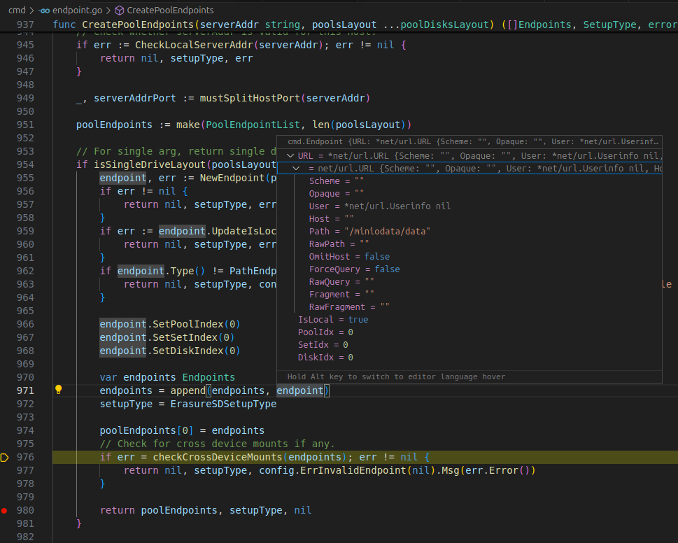
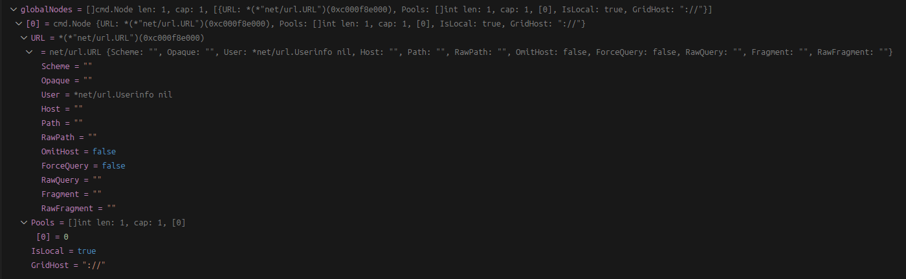

## 2.4 基础数据结构

对象存储系统有很多基础的概念，需要有响应的数据结构抽象实现。本节将展示Minio对象存储中的基础数据结构。并将展示一些数据结构(`minio server /miniodata/data`)的实例状态。

### 2.4.1 对象


### 2.4.2 端点

端点(Endpoint）存储了服务点或实例的详细信息。
```
// Endpoint - any type of endpoint.
type Endpoint struct {
	*url.URL
	IsLocal bool

	PoolIdx, SetIdx, DiskIdx int
}
```


一个储存池中的端点由`PoolEndpoints`类型表示。
```
// PoolEndpoints represent endpoints in a given pool
// along with its setCount and setDriveCount.
type PoolEndpoints struct {
	// indicates if endpoints are provided in non-ellipses style
	Legacy       bool
	SetCount     int
	DrivesPerSet int
	Endpoints    Endpoints
	CmdLine      string
	Platform     string
}

// EndpointServerPools - list of list of endpoints
type EndpointServerPools []PoolEndpoints
```
### 2.4.2 节点
集群中的节点:
```
// Node holds information about a node in this cluster
type Node struct {
	*url.URL
	Pools    []int
	IsLocal  bool
	GridHost string
}
```
当前集群只有一个当前机器节点。


### 2.4.2 事件

事件（Event）是用来通知特定行为，动作或状态的发生，需要呈现时间，地点，主角已经相关的状态信息。Minio将其抽象为`Event`类型（位于文件`/minio/internal/event/event.go`中）：
```
// Event represents event notification information defined in
// http://docs.aws.amazon.com/AmazonS3/latest/dev/notification-content-structure.html.
type Event struct {
	EventVersion      string            `json:"eventVersion"`
	EventSource       string            `json:"eventSource"`
	AwsRegion         string            `json:"awsRegion"`
	EventTime         string            `json:"eventTime"`
	EventName         Name              `json:"eventName"`
	UserIdentity      Identity          `json:"userIdentity"`
	RequestParameters map[string]string `json:"requestParameters"`
	ResponseElements  map[string]string `json:"responseElements"`
	S3                Metadata          `json:"s3"`
	Source            Source            `json:"source"`
	Type              madmin.TraceType  `json:"-"`
}
```
事件中通常需要描述相关的桶和对象，分别抽象为如下的数据结构：
```
// Bucket represents bucket metadata of the event.
type Bucket struct {
	Name          string   `json:"name"`
	OwnerIdentity Identity `json:"ownerIdentity"`
	ARN           string   `json:"arn"`
}

// Object represents object metadata of the event.
type Object struct {
	Key          string            `json:"key"`
	Size         int64             `json:"size,omitempty"`
	ETag         string            `json:"eTag,omitempty"`
	ContentType  string            `json:"contentType,omitempty"`
	UserMetadata map[string]string `json:"userMetadata,omitempty"`
	VersionID    string            `json:"versionId,omitempty"`
	Sequencer    string            `json:"sequencer"`
}
```
客户端的抽象：
```
// Source represents client information who triggered the event.
type Source struct {
	Host      string `json:"host"`
	Port      string `json:"port"`
	UserAgent string `json:"userAgent"`
}
```