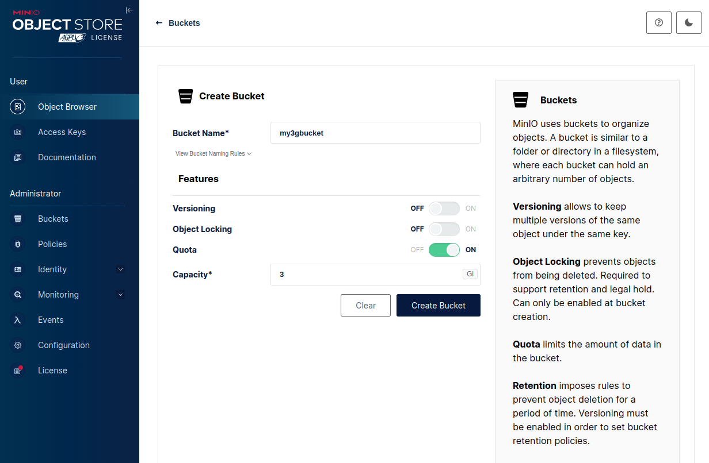

## 2.5 多盘启动
本章开篇我们看到了单个存储路径启动Minio服务。现在我们将探索多个存储路径启动Minio服务。
```
./minio server /miniodata/disk1 /miniodata/disk2 /miniodata/disk3 /miniodata/disk4
```

```
$ for i in {1..4}; do dd if=/dev/zero of=disk${i}.img bs=1M count=1000; done

$ for i in {1..4};do sudo losetup --find --show disk${i}.img; done
/dev/loop35
/dev/loop36
/dev/loop37
/dev/loop38
```
XFS format
```
$ for i in {1..4}; do sudo mkfs.xfs /dev/loop$((i + 34)) -L MINIODISK${i}; done
meta-data=/dev/loop35            isize=512    agcount=4, agsize=64000 blks
         =                       sectsz=512   attr=2, projid32bit=1
         =                       crc=1        finobt=1, sparse=1, rmapbt=1
         =                       reflink=1    bigtime=1 inobtcount=1 nrext64=0
data     =                       bsize=4096   blocks=256000, imaxpct=25
         =                       sunit=0      swidth=0 blks
naming   =version 2              bsize=4096   ascii-ci=0, ftype=1
log      =internal log           bsize=4096   blocks=16384, version=2
         =                       sectsz=512   sunit=0 blks, lazy-count=1
realtime =none                   extsz=4096   blocks=0, rtextents=0
Discarding blocks...Done.
meta-data=/dev/loop36            isize=512    agcount=4, agsize=64000 blks
         =                       sectsz=512   attr=2, projid32bit=1
         =                       crc=1        finobt=1, sparse=1, rmapbt=1
         =                       reflink=1    bigtime=1 inobtcount=1 nrext64=0
data     =                       bsize=4096   blocks=256000, imaxpct=25
         =                       sunit=0      swidth=0 blks
naming   =version 2              bsize=4096   ascii-ci=0, ftype=1
log      =internal log           bsize=4096   blocks=16384, version=2
         =                       sectsz=512   sunit=0 blks, lazy-count=1
realtime =none                   extsz=4096   blocks=0, rtextents=0
Discarding blocks...Done.
meta-data=/dev/loop37            isize=512    agcount=4, agsize=64000 blks
         =                       sectsz=512   attr=2, projid32bit=1
         =                       crc=1        finobt=1, sparse=1, rmapbt=1
         =                       reflink=1    bigtime=1 inobtcount=1 nrext64=0
data     =                       bsize=4096   blocks=256000, imaxpct=25
         =                       sunit=0      swidth=0 blks
naming   =version 2              bsize=4096   ascii-ci=0, ftype=1
log      =internal log           bsize=4096   blocks=16384, version=2
         =                       sectsz=512   sunit=0 blks, lazy-count=1
realtime =none                   extsz=4096   blocks=0, rtextents=0
Discarding blocks...Done.
meta-data=/dev/loop38            isize=512    agcount=4, agsize=64000 blks
         =                       sectsz=512   attr=2, projid32bit=1
         =                       crc=1        finobt=1, sparse=1, rmapbt=1
         =                       reflink=1    bigtime=1 inobtcount=1 nrext64=0
data     =                       bsize=4096   blocks=256000, imaxpct=25
         =                       sunit=0      swidth=0 blks
naming   =version 2              bsize=4096   ascii-ci=0, ftype=1
log      =internal log           bsize=4096   blocks=16384, version=2
         =                       sectsz=512   sunit=0 blks, lazy-count=1
realtime =none                   extsz=4096   blocks=0, rtextents=0
Discarding blocks...Done.
```
Mount
```
/miniodata$ for i in {1..4}; do sudo mount /dev/loop$((i + 34)) disk${i}; done
```

### 2.5.1 Server Started
```
 ./minio server /miniodata/disk1 /miniodata/disk2 /miniodata/disk3 /miniodata/disk4
INFO: Formatting 1st pool, 1 set(s), 4 drives per set.
INFO: WARNING: Host local has more than 2 drives of set. A host failure will result in data becoming unavailable.
MinIO Object Storage Server
Copyright: 2015-2025 MinIO, Inc.
License: GNU AGPLv3 - https://www.gnu.org/licenses/agpl-3.0.html
Version: DEVELOPMENT.2025-01-19T23-13-17Z (go1.23.4 linux/amd64)

API: http://192.168.1.3:9000  http://127.0.0.1:9000 
   RootUser: minioadmin 
   RootPass: minioadmin 

WebUI: http://192.168.1.3:34937 http://127.0.0.1:34937     
   RootUser: minioadmin 
   RootPass: minioadmin 

CLI: https://min.io/docs/minio/linux/reference/minio-mc.html#quickstart
   $ mc alias set 'myminio' 'http://192.168.1.3:9000' 'minioadmin' 'minioadmin'

Docs: https://docs.min.io
WARN: Detected default credentials 'minioadmin:minioadmin', we recommend that you change these values with 'MINIO_ROOT_USER' and 'MINIO_ROOT_PASSWORD' environment variables
```
Folder for disk1
```
$ tree -aph /miniodata/disk*
[drwxr-xr-x   24]  /miniodata/disk1
└── [drwxrwxr-x   98]  .minio.sys
    ├── [drwxrwxr-x   77]  buckets
    │   ├── [drwxrwxr-x   21]  .background-heal.json
    │   │   └── [-rw-rw-r--  466]  xl.meta
    │   ├── [drwxrwxr-x   21]  .bloomcycle.bin
    │   │   └── [-rw-rw-r--  479]  xl.meta
    │   └── [drwxrwxr-x   21]  .usage.json
    │       └── [-rw-rw-r--  534]  xl.meta
    ├── [drwxrwxr-x   36]  config
    │   ├── [drwxrwxr-x   21]  config.json
    │   │   └── [-rw-rw-r-- 5.1K]  xl.meta
    │   └── [drwxrwxr-x   36]  iam
    │       ├── [drwxrwxr-x   21]  format.json
    │       │   └── [-rw-rw-r--  431]  xl.meta
    │       └── [drwxrwxr-x   34]  sts
    │           └── [drwxrwxr-x   27]  DLSEAIB9EKZYDCG2RMCU
    │               └── [drwxrwxr-x   21]  identity.json
    │                   └── [-rw-rw-r--  672]  xl.meta
    ├── [-rw-rw-r--  342]  format.json
    ├── [drwxrwxr-x    6]  multipart
    ├── [drwxrwxr-x   21]  pool.bin
    │   └── [-rw-rw-r--  489]  xl.meta
    └── [drwxrwxr-x   64]  tmp
        ├── [-rw-rw-r-- 2.0K]  14053958-cb83-4303-808d-154b0afbedf7
        └── [drwxrwxr-x   94]  .trash
            ├── [drwxrwxr-x   25]  a24755f1-a9c2-44c7-9be6-af2695d0787e
            │   └── [-rw-rw-r--  534]  xl.meta.bkp
            └── [drwxrwxr-x   25]  cc8f3162-6793-4ad5-a45c-057c3018e4dd
                └── [-rw-rw-r--  471]  xl.meta.bkp
[-rw-rw-r-- 1000M]  /miniodata/disk1.img  [error opening dir]
```
All Fodlers
```
[drwxr-xr-x   24]  /miniodata/disk2
└── [drwxrwxr-x   98]  .minio.sys
    ├── [drwxrwxr-x   77]  buckets
    │   ├── [drwxrwxr-x   21]  .background-heal.json
    │   │   └── [-rw-rw-r--  466]  xl.meta
    │   ├── [drwxrwxr-x   21]  .bloomcycle.bin
    │   │   └── [-rw-rw-r--  479]  xl.meta
    │   └── [drwxrwxr-x   21]  .usage.json
    │       └── [-rw-rw-r--  534]  xl.meta
    ├── [drwxrwxr-x   36]  config
    │   ├── [drwxrwxr-x   21]  config.json
    │   │   └── [-rw-rw-r-- 5.1K]  xl.meta
    │   └── [drwxrwxr-x   36]  iam
    │       ├── [drwxrwxr-x   21]  format.json
    │       │   └── [-rw-rw-r--  431]  xl.meta
    │       └── [drwxrwxr-x   34]  sts
    │           └── [drwxrwxr-x   27]  DLSEAIB9EKZYDCG2RMCU
    │               └── [drwxrwxr-x   21]  identity.json
    │                   └── [-rw-rw-r--  672]  xl.meta
    ├── [-rw-rw-r--  342]  format.json
    ├── [drwxrwxr-x    6]  multipart
    ├── [drwxrwxr-x   21]  pool.bin
    │   └── [-rw-rw-r--  489]  xl.meta
    └── [drwxrwxr-x   64]  tmp
        ├── [-rw-rw-r-- 2.0K]  ab3b3130-9c4c-42d0-958e-6add8dbe44dd
        └── [drwxrwxr-x   94]  .trash
            ├── [drwxrwxr-x   25]  9ff0e18d-2cc7-4c56-883d-35fa0a41a67d
            │   └── [-rw-rw-r--  471]  xl.meta.bkp
            └── [drwxrwxr-x   25]  e1052790-d2a0-4cd7-a5b2-8c1fc4ca28fc
                └── [-rw-rw-r--  534]  xl.meta.bkp
[-rw-rw-r-- 1000M]  /miniodata/disk2.img  [error opening dir]
[drwxr-xr-x   24]  /miniodata/disk3
└── [drwxrwxr-x   98]  .minio.sys
    ├── [drwxrwxr-x   77]  buckets
    │   ├── [drwxrwxr-x   21]  .background-heal.json
    │   │   └── [-rw-rw-r--  466]  xl.meta
    │   ├── [drwxrwxr-x   21]  .bloomcycle.bin
    │   │   └── [-rw-rw-r--  479]  xl.meta
    │   └── [drwxrwxr-x   21]  .usage.json
    │       └── [-rw-rw-r--  534]  xl.meta
    ├── [drwxrwxr-x   36]  config
    │   ├── [drwxrwxr-x   21]  config.json
    │   │   └── [-rw-rw-r-- 5.1K]  xl.meta
    │   └── [drwxrwxr-x   36]  iam
    │       ├── [drwxrwxr-x   21]  format.json
    │       │   └── [-rw-rw-r--  431]  xl.meta
    │       └── [drwxrwxr-x   34]  sts
    │           └── [drwxrwxr-x   27]  DLSEAIB9EKZYDCG2RMCU
    │               └── [drwxrwxr-x   21]  identity.json
    │                   └── [-rw-rw-r--  672]  xl.meta
    ├── [-rw-rw-r--  342]  format.json
    ├── [drwxrwxr-x    6]  multipart
    ├── [drwxrwxr-x   21]  pool.bin
    │   └── [-rw-rw-r--  489]  xl.meta
    └── [drwxrwxr-x   64]  tmp
        ├── [-rw-rw-r-- 2.0K]  71b03de7-9b4e-46e6-8451-6db79ab0619e
        └── [drwxrwxr-x   94]  .trash
            ├── [drwxrwxr-x   25]  1c7dca56-5e07-4699-94ba-f47d97a5d50e
            │   └── [-rw-rw-r--  471]  xl.meta.bkp
            └── [drwxrwxr-x   25]  dda809a6-635b-43a5-924b-f37c254be013
                └── [-rw-rw-r--  534]  xl.meta.bkp
[-rw-rw-r-- 1000M]  /miniodata/disk3.img  [error opening dir]
[drwxr-xr-x   24]  /miniodata/disk4
└── [drwxrwxr-x   98]  .minio.sys
    ├── [drwxrwxr-x   77]  buckets
    │   ├── [drwxrwxr-x   21]  .background-heal.json
    │   │   └── [-rw-rw-r--  466]  xl.meta
    │   ├── [drwxrwxr-x   21]  .bloomcycle.bin
    │   │   └── [-rw-rw-r--  479]  xl.meta
    │   └── [drwxrwxr-x   21]  .usage.json
    │       └── [-rw-rw-r--  534]  xl.meta
    ├── [drwxrwxr-x   36]  config
    │   ├── [drwxrwxr-x   21]  config.json
    │   │   └── [-rw-rw-r-- 5.1K]  xl.meta
    │   └── [drwxrwxr-x   36]  iam
    │       ├── [drwxrwxr-x   21]  format.json
    │       │   └── [-rw-rw-r--  431]  xl.meta
    │       └── [drwxrwxr-x   34]  sts
    │           └── [drwxrwxr-x   27]  DLSEAIB9EKZYDCG2RMCU
    │               └── [drwxrwxr-x   21]  identity.json
    │                   └── [-rw-rw-r--  672]  xl.meta
    ├── [-rw-rw-r--  342]  format.json
    ├── [drwxrwxr-x    6]  multipart
    ├── [drwxrwxr-x   21]  pool.bin
    │   └── [-rw-rw-r--  489]  xl.meta
    └── [drwxrwxr-x   64]  tmp
        ├── [-rw-rw-r-- 2.0K]  a62eaf3d-5c4b-4d09-b8ed-fc16b7fe14ba
        └── [drwxrwxr-x   94]  .trash
            ├── [drwxrwxr-x   25]  4a224951-2183-43cc-80d5-d9b02aa497c1
            │   └── [-rw-rw-r--  534]  xl.meta.bkp
            └── [drwxrwxr-x   25]  7e2a6c89-d3ce-4702-b598-2776c57b70b4
                └── [-rw-rw-r--  471]  xl.meta.bkp
[-rw-rw-r-- 1000M]  /miniodata/disk4.img  [error opening dir]

76 directories, 48 files
```
通过Web GUI创建一个名为`my3gbucket`的对象桶

Folder disk1
```
/miniodata$ tree -aph /miniodata/disk*
[drwxr-xr-x   42]  /miniodata/disk1
├── [drwxrwxr-x   98]  .minio.sys
│   ├── [drwxrwxr-x  147]  buckets
│   │   ├── [drwxrwxr-x   21]  .background-heal.json
│   │   │   └── [-rw-rw-r--  466]  xl.meta
│   │   ├── [drwxrwxr-x   21]  .bloomcycle.bin
│   │   │   └── [-rw-rw-r--  530]  xl.meta
│   │   ├── [drwxrwxr-x   79]  my3gbucket
│   │   │   ├── [drwxrwxr-x   21]  .metadata.bin
│   │   │   │   └── [-rw-rw-r--  853]  xl.meta
│   │   │   ├── [drwxrwxr-x   21]  .usage-cache.bin
│   │   │   │   └── [-rw-rw-r--  509]  xl.meta
│   │   │   └── [drwxrwxr-x   21]  .usage-cache.bin.bkp
│   │   │       └── [-rw-rw-r--  509]  xl.meta
│   │   ├── [drwxrwxr-x   21]  .usage-cache.bin
│   │   │   └── [-rw-rw-r--  521]  xl.meta
│   │   ├── [drwxrwxr-x   21]  .usage-cache.bin.bkp
│   │   │   └── [-rw-rw-r--  521]  xl.meta
│   │   └── [drwxrwxr-x   21]  .usage.json
│   │       └── [-rw-rw-r--  963]  xl.meta
│   ├── [drwxrwxr-x   36]  config
│   │   ├── [drwxrwxr-x   21]  config.json
│   │   │   └── [-rw-rw-r-- 5.1K]  xl.meta
│   │   └── [drwxrwxr-x   36]  iam
│   │       ├── [drwxrwxr-x   21]  format.json
│   │       │   └── [-rw-rw-r--  431]  xl.meta
│   │       └── [drwxrwxr-x   34]  sts
│   │           └── [drwxrwxr-x   27]  DLSEAIB9EKZYDCG2RMCU
│   │               └── [drwxrwxr-x   21]  identity.json
│   │                   └── [-rw-rw-r--  672]  xl.meta
│   ├── [-rw-rw-r--  342]  format.json
│   ├── [drwxrwxr-x    6]  multipart
│   ├── [drwxrwxr-x   21]  pool.bin
│   │   └── [-rw-rw-r--  489]  xl.meta
│   └── [drwxrwxr-x   64]  tmp
│       ├── [-rw-rw-r-- 2.0K]  14053958-cb83-4303-808d-154b0afbedf7
│       └── [drwxrwxr-x 4.0K]  .trash
│           ├── [drwxrwxr-x   25]  3504c959-9ce8-4890-985a-52a6fd2f2841
│           │   └── [-rw-rw-r--  515]  xl.meta.bkp
│           ├── [drwxrwxr-x   25]  5a6b0b0d-9ff7-42ac-a59b-8bec7722324b
│           │   └── [-rw-rw-r--  534]  xl.meta.bkp
│           ├── [drwxrwxr-x   25]  68b68b38-62a2-4eb4-8936-6d705f846eb4
│           │   └── [-rw-rw-r--  507]  xl.meta.bkp
│           ├── [drwxrwxr-x   25]  6ae2cd19-6314-4b7a-b0ca-5aed51441bcf
│           │   └── [-rw-rw-r--  534]  xl.meta.bkp
│           ├── [drwxrwxr-x   25]  6c500bac-ec90-4bdd-aa19-31e5e0715828
│           │   └── [-rw-rw-r--  534]  xl.meta.bkp
│           ├── [drwxrwxr-x   25]  85bb4325-822e-4061-a556-2170a6bdd148
│           │   └── [-rw-rw-r--  494]  xl.meta.bkp
│           ├── [drwxrwxr-x   25]  973ff991-8ea1-4c69-bb49-e8277b39c729
│           │   └── [-rw-rw-r--  534]  xl.meta.bkp
│           ├── [drwxrwxr-x   25]  c1835231-3475-4cc4-af4c-98b6025d2134
│           │   └── [-rw-rw-r--  818]  xl.meta.bkp
│           └── [drwxrwxr-x   25]  cdea54c7-ad67-434e-b2d9-a5f950057b1e
│               └── [-rw-rw-r--  522]  xl.meta.bkp
└── [drwxrwxr-x    6]  my3gbucket
[-rw-rw-r-- 1000M]  /miniodata/disk1.img  [error opening dir]
```
```
[drwxr-xr-x   42]  /miniodata/disk2
├── [drwxrwxr-x   98]  .minio.sys
│   ├── [drwxrwxr-x  147]  buckets
│   │   ├── [drwxrwxr-x   21]  .background-heal.json
│   │   │   └── [-rw-rw-r--  466]  xl.meta
│   │   ├── [drwxrwxr-x   21]  .bloomcycle.bin
│   │   │   └── [-rw-rw-r--  530]  xl.meta
│   │   ├── [drwxrwxr-x   79]  my3gbucket
│   │   │   ├── [drwxrwxr-x   21]  .metadata.bin
│   │   │   │   └── [-rw-rw-r--  853]  xl.meta
│   │   │   ├── [drwxrwxr-x   21]  .usage-cache.bin
│   │   │   │   └── [-rw-rw-r--  509]  xl.meta
│   │   │   └── [drwxrwxr-x   21]  .usage-cache.bin.bkp
│   │   │       └── [-rw-rw-r--  509]  xl.meta
│   │   ├── [drwxrwxr-x   21]  .usage-cache.bin
│   │   │   └── [-rw-rw-r--  521]  xl.meta
│   │   ├── [drwxrwxr-x   21]  .usage-cache.bin.bkp
│   │   │   └── [-rw-rw-r--  521]  xl.meta
│   │   └── [drwxrwxr-x   21]  .usage.json
│   │       └── [-rw-rw-r--  963]  xl.meta
│   ├── [drwxrwxr-x   36]  config
│   │   ├── [drwxrwxr-x   21]  config.json
│   │   │   └── [-rw-rw-r-- 5.1K]  xl.meta
│   │   └── [drwxrwxr-x   36]  iam
│   │       ├── [drwxrwxr-x   21]  format.json
│   │       │   └── [-rw-rw-r--  431]  xl.meta
│   │       └── [drwxrwxr-x   34]  sts
│   │           └── [drwxrwxr-x   27]  DLSEAIB9EKZYDCG2RMCU
│   │               └── [drwxrwxr-x   21]  identity.json
│   │                   └── [-rw-rw-r--  672]  xl.meta
│   ├── [-rw-rw-r--  342]  format.json
│   ├── [drwxrwxr-x    6]  multipart
│   ├── [drwxrwxr-x   21]  pool.bin
│   │   └── [-rw-rw-r--  489]  xl.meta
│   └── [drwxrwxr-x   64]  tmp
│       ├── [-rw-rw-r-- 2.0K]  ab3b3130-9c4c-42d0-958e-6add8dbe44dd
│       └── [drwxrwxr-x 4.0K]  .trash
│           ├── [drwxrwxr-x   25]  0be8b978-24ac-4293-974c-d770c9df0602
│           │   └── [-rw-rw-r--  534]  xl.meta.bkp
│           ├── [drwxrwxr-x   25]  27670946-6ce8-4802-bfc4-c967f485083d
│           │   └── [-rw-rw-r--  522]  xl.meta.bkp
│           ├── [drwxrwxr-x   25]  32fa8a6d-c679-4aa2-b23a-2b902c3a049d
│           │   └── [-rw-rw-r--  515]  xl.meta.bkp
│           ├── [drwxrwxr-x   25]  637db620-8dee-4115-8f8b-4b57094c0b27
│           │   └── [-rw-rw-r--  818]  xl.meta.bkp
│           ├── [drwxrwxr-x   25]  674ed9d7-6da9-4558-8c69-add97e0bf030
│           │   └── [-rw-rw-r--  494]  xl.meta.bkp
│           ├── [drwxrwxr-x   25]  97510837-2fe8-4b1d-9635-4e75f7b16375
│           │   └── [-rw-rw-r--  534]  xl.meta.bkp
│           ├── [drwxrwxr-x   25]  aaae8ca7-0eeb-4cfa-8546-2d871b7f0c66
│           │   └── [-rw-rw-r--  534]  xl.meta.bkp
│           ├── [drwxrwxr-x   25]  b2bf493f-dd68-4a72-9d0e-bdd80c406c22
│           │   └── [-rw-rw-r--  534]  xl.meta.bkp
│           └── [drwxrwxr-x   25]  b5076104-7072-48d4-9462-55ddfeca574e
│               └── [-rw-rw-r--  507]  xl.meta.bkp
└── [drwxrwxr-x    6]  my3gbucket
[-rw-rw-r-- 1000M]  /miniodata/disk2.img  [error opening dir]
[drwxr-xr-x   42]  /miniodata/disk3
├── [drwxrwxr-x   98]  .minio.sys
│   ├── [drwxrwxr-x  147]  buckets
│   │   ├── [drwxrwxr-x   21]  .background-heal.json
│   │   │   └── [-rw-rw-r--  466]  xl.meta
│   │   ├── [drwxrwxr-x   21]  .bloomcycle.bin
│   │   │   └── [-rw-rw-r--  530]  xl.meta
│   │   ├── [drwxrwxr-x   79]  my3gbucket
│   │   │   ├── [drwxrwxr-x   21]  .metadata.bin
│   │   │   │   └── [-rw-rw-r--  853]  xl.meta
│   │   │   ├── [drwxrwxr-x   21]  .usage-cache.bin
│   │   │   │   └── [-rw-rw-r--  509]  xl.meta
│   │   │   └── [drwxrwxr-x   21]  .usage-cache.bin.bkp
│   │   │       └── [-rw-rw-r--  509]  xl.meta
│   │   ├── [drwxrwxr-x   21]  .usage-cache.bin
│   │   │   └── [-rw-rw-r--  521]  xl.meta
│   │   ├── [drwxrwxr-x   21]  .usage-cache.bin.bkp
│   │   │   └── [-rw-rw-r--  521]  xl.meta
│   │   └── [drwxrwxr-x   21]  .usage.json
│   │       └── [-rw-rw-r--  963]  xl.meta
│   ├── [drwxrwxr-x   36]  config
│   │   ├── [drwxrwxr-x   21]  config.json
│   │   │   └── [-rw-rw-r-- 5.1K]  xl.meta
│   │   └── [drwxrwxr-x   36]  iam
│   │       ├── [drwxrwxr-x   21]  format.json
│   │       │   └── [-rw-rw-r--  431]  xl.meta
│   │       └── [drwxrwxr-x   34]  sts
│   │           └── [drwxrwxr-x   27]  DLSEAIB9EKZYDCG2RMCU
│   │               └── [drwxrwxr-x   21]  identity.json
│   │                   └── [-rw-rw-r--  672]  xl.meta
│   ├── [-rw-rw-r--  342]  format.json
│   ├── [drwxrwxr-x    6]  multipart
│   ├── [drwxrwxr-x   21]  pool.bin
│   │   └── [-rw-rw-r--  489]  xl.meta
│   └── [drwxrwxr-x   64]  tmp
│       ├── [-rw-rw-r-- 2.0K]  71b03de7-9b4e-46e6-8451-6db79ab0619e
│       └── [drwxrwxr-x 4.0K]  .trash
│           ├── [drwxrwxr-x   25]  1d76cab7-4cff-445e-8bf9-951040467981
│           │   └── [-rw-rw-r--  515]  xl.meta.bkp
│           ├── [drwxrwxr-x   25]  29cc3bdb-a9c1-4ece-a97c-595201c79359
│           │   └── [-rw-rw-r--  494]  xl.meta.bkp
│           ├── [drwxrwxr-x   25]  6f272dca-6c76-46ee-bdb8-0a806e983b22
│           │   └── [-rw-rw-r--  818]  xl.meta.bkp
│           ├── [drwxrwxr-x   25]  7d02175b-4408-4ac5-90fe-40ad2efec4fc
│           │   └── [-rw-rw-r--  507]  xl.meta.bkp
│           ├── [drwxrwxr-x   25]  b4ab6e0e-a26e-4563-bfc6-a010a0dbaea2
│           │   └── [-rw-rw-r--  534]  xl.meta.bkp
│           ├── [drwxrwxr-x   25]  d16adc11-f1d6-483f-a4ef-3b1c211f6024
│           │   └── [-rw-rw-r--  534]  xl.meta.bkp
│           ├── [drwxrwxr-x   25]  e4c114ed-5a7e-4f10-9357-fc9376f91021
│           │   └── [-rw-rw-r--  534]  xl.meta.bkp
│           ├── [drwxrwxr-x   25]  ee357858-d501-4cc1-8a49-e0cbb41d9f3d
│           │   └── [-rw-rw-r--  522]  xl.meta.bkp
│           └── [drwxrwxr-x   25]  f36e30d1-27b3-4f5c-afe2-95ab87555425
│               └── [-rw-rw-r--  534]  xl.meta.bkp
└── [drwxrwxr-x    6]  my3gbucket
[-rw-rw-r-- 1000M]  /miniodata/disk3.img  [error opening dir]
[drwxr-xr-x   42]  /miniodata/disk4
├── [drwxrwxr-x   98]  .minio.sys
│   ├── [drwxrwxr-x  147]  buckets
│   │   ├── [drwxrwxr-x   21]  .background-heal.json
│   │   │   └── [-rw-rw-r--  466]  xl.meta
│   │   ├── [drwxrwxr-x   21]  .bloomcycle.bin
│   │   │   └── [-rw-rw-r--  530]  xl.meta
│   │   ├── [drwxrwxr-x   79]  my3gbucket
│   │   │   ├── [drwxrwxr-x   21]  .metadata.bin
│   │   │   │   └── [-rw-rw-r--  853]  xl.meta
│   │   │   ├── [drwxrwxr-x   21]  .usage-cache.bin
│   │   │   │   └── [-rw-rw-r--  509]  xl.meta
│   │   │   └── [drwxrwxr-x   21]  .usage-cache.bin.bkp
│   │   │       └── [-rw-rw-r--  509]  xl.meta
│   │   ├── [drwxrwxr-x   21]  .usage-cache.bin
│   │   │   └── [-rw-rw-r--  521]  xl.meta
│   │   ├── [drwxrwxr-x   21]  .usage-cache.bin.bkp
│   │   │   └── [-rw-rw-r--  521]  xl.meta
│   │   └── [drwxrwxr-x   21]  .usage.json
│   │       └── [-rw-rw-r--  963]  xl.meta
│   ├── [drwxrwxr-x   36]  config
│   │   ├── [drwxrwxr-x   21]  config.json
│   │   │   └── [-rw-rw-r-- 5.1K]  xl.meta
│   │   └── [drwxrwxr-x   36]  iam
│   │       ├── [drwxrwxr-x   21]  format.json
│   │       │   └── [-rw-rw-r--  431]  xl.meta
│   │       └── [drwxrwxr-x   34]  sts
│   │           └── [drwxrwxr-x   27]  DLSEAIB9EKZYDCG2RMCU
│   │               └── [drwxrwxr-x   21]  identity.json
│   │                   └── [-rw-rw-r--  672]  xl.meta
│   ├── [-rw-rw-r--  342]  format.json
│   ├── [drwxrwxr-x    6]  multipart
│   ├── [drwxrwxr-x   21]  pool.bin
│   │   └── [-rw-rw-r--  489]  xl.meta
│   └── [drwxrwxr-x   64]  tmp
│       ├── [-rw-rw-r-- 2.0K]  a62eaf3d-5c4b-4d09-b8ed-fc16b7fe14ba
│       └── [drwxrwxr-x 4.0K]  .trash
│           ├── [drwxrwxr-x   25]  046e7650-19a4-4eb9-a7cb-315b88d05272
│           │   └── [-rw-rw-r--  494]  xl.meta.bkp
│           ├── [drwxrwxr-x   25]  58303863-e25f-42c5-a404-0b1c1446820d
│           │   └── [-rw-rw-r--  515]  xl.meta.bkp
│           ├── [drwxrwxr-x   25]  6fcb957c-8d8f-46bb-aff5-9cf296f25d08
│           │   └── [-rw-rw-r--  534]  xl.meta.bkp
│           ├── [drwxrwxr-x   25]  9b2b6f76-9e08-4893-b2b4-cbda6cf5ba79
│           │   └── [-rw-rw-r--  534]  xl.meta.bkp
│           ├── [drwxrwxr-x   25]  aa30bbcb-942c-4c2d-8b7c-b25cc6ea63a1
│           │   └── [-rw-rw-r--  534]  xl.meta.bkp
│           ├── [drwxrwxr-x   25]  c0bbeb30-93b6-4824-90df-d5c325578fa0
│           │   └── [-rw-rw-r--  818]  xl.meta.bkp
│           ├── [drwxrwxr-x   25]  c85fd52d-8614-4b2a-82ed-2de7c85b69c5
│           │   └── [-rw-rw-r--  534]  xl.meta.bkp
│           ├── [drwxrwxr-x   25]  d410f64b-9def-4222-aae4-d02f78be927d
│           │   └── [-rw-rw-r--  522]  xl.meta.bkp
│           └── [drwxrwxr-x   25]  f79a9a9f-4518-46d1-8853-b1194375b2bb
│               └── [-rw-rw-r--  507]  xl.meta.bkp
└── [drwxrwxr-x    6]  my3gbucket
[-rw-rw-r-- 1000M]  /miniodata/disk4.img  [error opening dir]

132 directories, 96 files
```